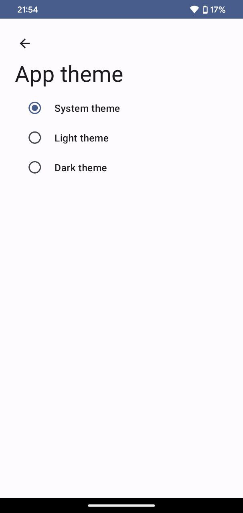

# Change Theme feature module

The Kotlin Multiplatform Choose Theme feature module allows developers to create a unified user experience across multiple platforms by allowing the end-user to choose from a selection of pre-defined color themes. The module is designed to be used in a Kotlin Multiplatform project, where the codebase is shared across multiple platforms, such as iOS, Android, and Web.

This feature module is fully customizable and can be easily integrated into an existing Kotlin Multiplatform project. The module uses the Kotlin programming language, which provides a seamless integration with existing Java or Swift code. The module is also designed to be scalable, so that additional themes can be added or existing themes can be modified as needed.

The Choose Theme feature allows the end-user to switch between different color themes at runtime, providing a unique and personalized user experience. The module provides a simple API that developers can use to define and manage the different themes. The themes are stored in a central location, making it easy to manage and update the themes as needed.

Overall, the Kotlin Multiplatform Choose Theme feature module is an ideal solution for developers who are looking to provide a unified user experience across multiple platforms while giving their users the ability to personalize their experience with different color themes.



# How to use
Change theme is a kotlin multiplatform library that contains multiplatform domain part and presentation implementation.

Setup dependency resolution management:
```
dependencyResolutionManagement {
    def githubProperties = new Properties()
    File propsFile = file("github.properties")
    if (propsFile.isFile()) {
        propsFile.withInputStream { githubProperties.load(it) }
    } else {
        githubProperties["github_username"] = System.getenv('GITHUB_USERNAME')
        githubProperties["github_password"] = System.getenv('GITHUB_PASSWORD')
    }
    repositories {
        google()
        mavenCentral()
        maven {
            url = uri("https://maven.pkg.github.com/IlyaPavlovskii/change-theme")
            credentials {
                username = githubProperties["github_username"]
                password = githubProperties["github_password"]
            }
        }
    }
}
```

Add dependencies:
```
// GUI implementation
implementation "io.github.ilyapavlovskii.kmm.change.theme:change-theme-android-compose-presentation:2023.02.10"
// Domain part
implementation "io.github.ilyapavlovskii.kmm.change.theme:change-theme-domain:2023.02.10"
```

Just connect to your theme `isDarkTheme()` function. If you want to use change theme screen, run `ChangeThemeScreen` and handle back function.
```kotlin
setContent {
    ChangeThemeTheme(darkTheme = isDarkTheme()) {
        // A surface container using the 'background' color from the theme
        Surface(
            modifier = Modifier.fillMaxSize(),
            color = MaterialTheme.colorScheme.background
        ) {
            ChangeThemeScreen(
                onBackClick = ::finish
            )
        }
    }
}
```