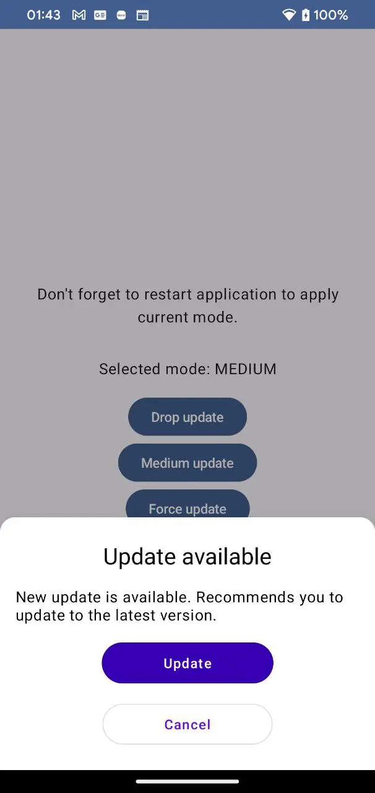
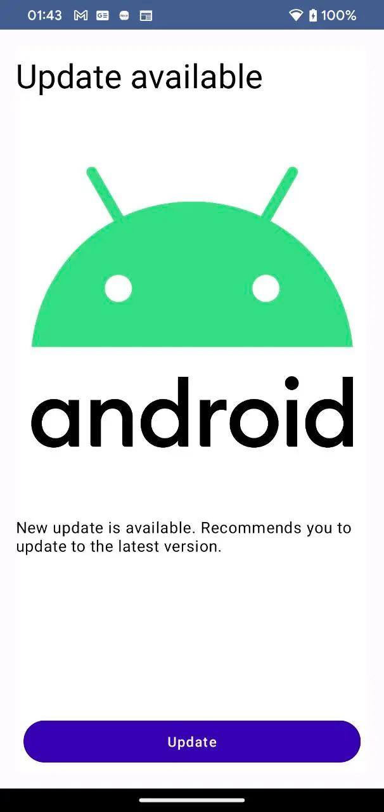

# Force Update module

This library provides an easy-to-use solution for implementing in-app updates in Android and iOS applications. With this library, you can prompt users to update your app to the latest version from within the app itself, without requiring them to go to the app store. This can improve the update speed and user experience, especially for critical updates.

### Features
* Supports both Android and iOS platforms
* Allows checking for updates and prompting the user to update within the app
* Supports flexible update types, such as immediate or flexible (in the background)
* Provides a customizable UI for the update prompt
* Includes error handling and fallback mechanisms
* Supports different update channels, such as beta or production

## Installation
To use this library in your Android or iOS app, simply add it as a dependency in your project:
First, you have to add dependency repository `https://maven.pkg.github.com/IlyaPavlovskii/force-update`:

```gradle
dependencyResolutionManagement {
    def githubProperties = new Properties()
    File propsFile = file("github.properties")
    if (propsFile.isFile()) {
        propsFile.withInputStream { githubProperties.load(it) }
    } else {
        githubProperties["github_username"] = System.getenv('GITHUB_USERNAME')
        githubProperties["github_password"] = System.getenv('GITHUB_PASSWORD')
    }

    repositoriesMode.set(RepositoriesMode.FAIL_ON_PROJECT_REPOS)
    repositories {
		 //...
        maven {
            url = uri("https://maven.pkg.github.com/IlyaPavlovskii/force-update")
            credentials {
                username = githubProperties["github_username"]
                password = githubProperties["github_password"]
            }
        }
    }
}
```

Add dependency to your `libs.versions.toml` file:

```
[versions]
io-github-ilyapavlovskii-kmm-force-update = "2023.03.23"

[libraries]
io-github-ilyapavlovskii-kmm-force-update-android-compose-presentation = { module = "io.github.ilyapavlovskii.kmm.force.update:force-update-android-compose-presentation", version.ref = "io-github-ilyapavlovskii-kmm-force-update" }
io-github-ilyapavlovskii-kmm-force-update-domain = { module = "io.github.ilyapavlovskii.kmm.force.update:force-update-domain", version.ref = "io-github-ilyapavlovskii-kmm-force-update" }
```

Or to the gradle file:

```
// GUI library
implementation "io.github.ilyapavlovskii.kmm.force.update:force-update-android-compose-presentation:2023.03.23"
// Domain declaration with implementation
implementation "io.github.ilyapavlovskii.kmm.force.update:force-update-domain:2023.03.23"
```


## Usage

Just add `AppUpdateScreen` to the root content above your content compose functions:

```
setContent {
    ForceUpdateTheme {
        Surface(
            modifier = Modifier.fillMaxSize(),
        ) {
            //.. your content
				
			// App update screen must be always above your content
            AppUpdateScreen(
                getForceUpdateEventFlowUseCase = useCase,
                applicationUri = Uri.parse("https://play.google.com/store/apps/details?id=by.bulba.ipsc.calculator"),
                onCancelListener = { useCase.update(ForceUpdateType.ABSENT) },
                onMediumUpdateClick = { useCase.update(ForceUpdateType.ABSENT) },
            )
        }
    }
}
```

You also might override default style for medium or force update styles. Override and pass the next models to the `AppUpdateScreen`: `mediumUpdateDialogStyle: MediumUpdateDialogStyle`, `forceUpdateStyle: ForceUpdateStyle`.

If it needed, you might to handle and process the next callbacks as: 

* `onUpdateClick: (context: Context) -> Unit` - to override update event default behavior
* `onCancelListener: () -> Unit` - to handle cancel event
* `onMediumUpdateClick: () -> Unit` - to handle successfull medium update click
* `onForceUpdateClick: () -> Unit` - to handle successfull force update click

To override default attributes, you might to override it too:

```	
<!-- possible attributes to override -->
<attr name="force_update__force_icon_vector" format="reference" />
<attr name="force_update__force_icon_raster" format="reference" />
<attr name="force_update__medium_title" format="string" />
<attr name="force_update__medium_description" format="string" />
<attr name="force_update__force_title" format="string" />
<attr name="force_update__force_description" format="string" />
<attr name="force_update__button_update" format="string" />
<attr name="force_update__button_cancel" format="string" />    


<style name="Theme.YourAppTheme" parent="android:Theme.Material.Light.NoActionBar" >
    <item name="force_update__force_icon_vector">@drawable/logo</item>
</style>

```

To start working with Firebase, we have prepared the next implementation `FirebaseGetForceUpdateEventFlowUseCase`. Just pass it as a primary use case to the `AppUpdateScreen` and put your remote config with when it needed:

```json
key = "app_update"
{
  "priority": "medium",
  "version_code": "9"
}
```
That means, application shows medium pop-up dialog with proposal to update application when user start it.
Possible priorities: `low`(without implementation), `medium`(shows pop-up dialog), `hight`(shows non-closable screen to force user update application before usage).

### Medium pop-up dialog


### Force pop-up dialog


## Contributing
Contributions are welcome! If you find a bug or have a feature request, please open an issue on GitHub. If you want to contribute code, please fork the repository and submit a pull request. 

---------------------------------------------------------------------------------
## License
```
Copyright 2023 Ilia Pavlovskii
Licensed under the Apache License, Version 2.0 (the "License");
you may not use this file except in compliance with the License.
You may obtain a copy of the License at
   http://www.apache.org/licenses/LICENSE-2.0
Unless required by applicable law or agreed to in writing, software
distributed under the License is distributed on an "AS IS" BASIS,
WITHOUT WARRANTIES OR CONDITIONS OF ANY KIND, either express or implied.
See the License for the specific language governing permissions and
limitations under the License.
```
---------------------------------------------------------------------------------
## Donate
If you want to thank me or contribute to the development of the backlog, you may donate me. That helps me to concentrate more on the project.

[](https://www.paypal.com/paypalme/ipavlovskii)
[](https://www.buymeacoffee.com/ipavlovskii)

You also might subscribe me on the next platforms to see any updates of my topics

[](https://pavlovskiiilia.medium.com/)
[](https://habr.com/ru/users/TranE91/posts/)

